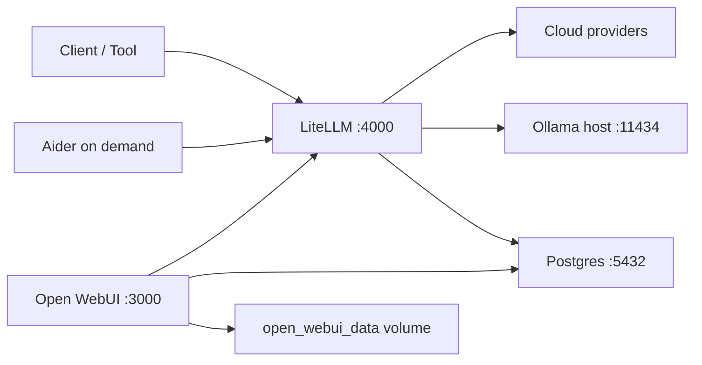

# Architecture Truth Layer

## Scope

This repo supports one local stack:

- Docker Compose for containerized runtime
- Host-level Ollama as an optional dependency
- PowerShell and WSL2 operator paths through one Python-based CLI

## Supported services

| Service | Kind | Module | Compose profile | Port | Role |
| --- | --- | --- | --- | --- | --- |
| `postgres` | compose | `core` | `hot`, `warm`, `aider` | `5432` | Shared persistence for LiteLLM and Open WebUI |
| `litellm` | compose | `core` | `hot`, `warm`, `aider` | `4000` | OpenAI-compatible gateway |
| `open-webui` | compose | `ui` | `warm` | `3000` | Optional UI |
| `aider` | compose, on-demand | `coding` | `aider` | `8501` | Ephemeral coding helper |
| `ollama` | host | `core` | n/a | `11434` | Optional local model runtime |

## Profiles and modules

Compose stays intentionally small:

- `hot`: minimal runtime
- `warm`: `hot` plus UI
- `aider`: `hot` plus the on-demand coding helper

Operator modules are the ergonomic layer:

- `core` -> `hot`
- `ui` -> `warm`
- `coding` -> `aider`

This gives modularity without multiplying Compose complexity.

## Data flow

## Supported OS and runtime paths

### Recommended

- Windows 11
- Docker Desktop with WSL2 integration
- Python 3.11+ in WSL2
- Ollama on the Windows host if local model fallback is desired

### Supported

- Windows 11 PowerShell
- Docker Desktop
- Python 3.11+ on Windows
- Optional Ollama on the host

## Runtime paths

- WSL2 entrypoint: `./stack.sh`
- PowerShell entrypoint: `.\stack.ps1`
- Installers: `install.sh`, `install-windows.ps1`
- Machine truth layer: `ops/stack.manifest.json`

## Principles

- Honest topology over demo theater
- Minimal always-on runtime
- Optional surfaces must stay explicit
- Generated artifacts must be reproducible
- Host-managed dependencies must stay visibly host-managed

## Constraints and limitations

- Ollama is not managed by Compose
- The dashboard is a generated snapshot, not a live control plane
- Aider is intentionally on-demand
- Open WebUI may start slowly on first warm boot
